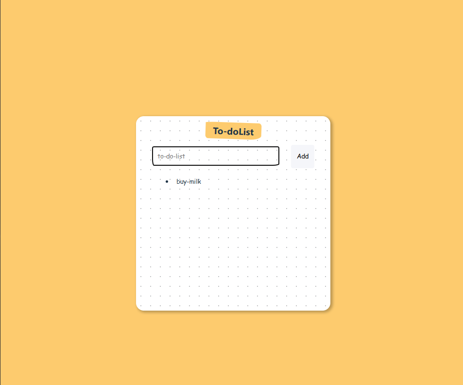

# ✅ To-do List React App

Este é um projeto simples de **To-do List** criado com **React + Vite**, onde o usuário pode:

- Digitar uma tarefa
- Adicionar a tarefa à lista
- Ver a lista de tarefas renderizada dinamicamente

---

## 🚀 Tecnologias usadas

- [React](https://react.dev/)
- [Vite](https://vitejs.dev/)
- [JavaScript (ES6+)](https://developer.mozilla.org/pt-BR/docs/Web/JavaScript)
- CSS

---

## 📷 Preview

 

---

## 📦 Instalação e uso

```bash
# 1. Clone o repositório
git clone https://github.com/seu-usuario/seu-repo.git

# 2. Acesse o diretório do projeto
cd seu-repo

# 3. Instale as dependências
npm install

# 4. Rode o projeto localmente
npm run dev
